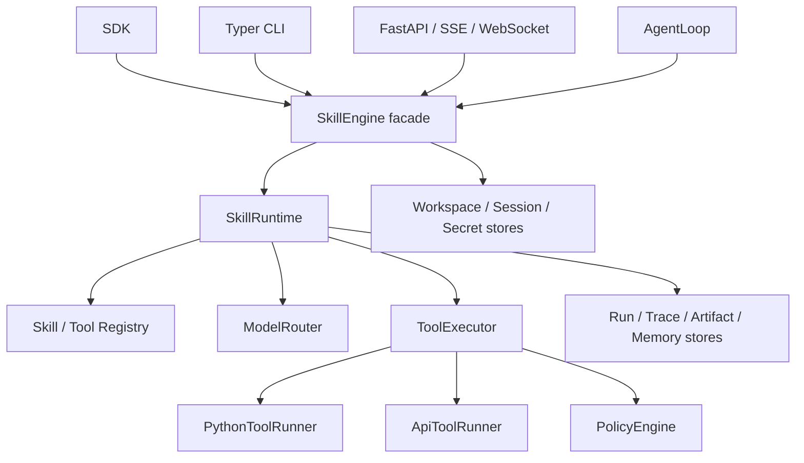

# Agent Engine

> 面向 Agent Engine AI 产品的 Python Skill 运行时基座。它把 **Skill 包、Tool 包、模型调用、工作流、Agent 路由、运行记录和 HTTP/CLI 接口** 收敛到一套可复用的运行内核中。

当前版本：`0.1.0`（工程验证版）。适合本地开发、原型验证和受控环境的单实例服务；距离多租户生产上线仍需完成本文“生产化门槛”中的工作。

## 目录

- [项目定位](#项目定位)
- [当前完成度](#当前完成度)
- [核心概念](#核心概念)
- [架构总览](#架构总览)
- [快速开始](#快速开始)
- [配置真实模型](#配置真实模型)
- [Skill 与 Tool 包规范](#skill-与-tool-包规范)
- [使用方式：SDK、CLI、HTTP](#使用方式sdkclihttp)
- [运行数据与安全边界](#运行数据与安全边界)
- [内置示例资源](#内置示例资源)
- [开发、测试与排障](#开发测试与排障)
- [生产化与迭代路线](#生产化与迭代路线)
- [文档索引](#文档索引)

## 项目定位

Agent Engine 的目标不是另一个聊天 UI，而是业务智能体的执行基座：把可版本化的业务能力打包成 Skill，把外部能力封装成 Tool，并对每一次执行提供输入/输出校验、可观察性、产物管理与权限控制。

它适用于内容生产、营销运营、内部流程助手、垂类工作流等场景。上层产品可以通过 SDK、CLI 或 FastAPI 使用同一个 `SkillEngine`；不需要为每种入口重复实现模型、工具、运行记录等基础能力。

## 当前完成度

截至本仓库当前提交，完整测试执行结果为 **127 passed，1 个第三方弃用警告**。下表描述的是代码已实现程度，不等同于生产 SLA。

| 领域 | 状态 | 已实现内容 |
| --- | --- | --- |
| Skill/Tool 包加载 | 可用 | YAML/JSON Schema 校验、注册表、目录扫描、catalog 持久化 |
| Skill 运行时 | 可用 | 输入输出校验、模型 tool-calling 循环、直接 Tool、串行/DAG 工作流、失败与审批恢复 |
| Tool 执行 | 可用 | Python 子进程 Tool、HTTP API Tool、OpenAPI operation 导入、超时、Schema 校验 |
| 模型网关 | 可用 | Mock、OpenAI-compatible、Anthropic-compatible；统一请求/响应模型 |
| Agent | 基础可用 | 显式 Skill、场景映射、关键词路由、必填输入补齐、低置信度确认、会话记录 |
| 工作区治理 | 基础可用 | workspace、identity、Skill 绑定、Tool allow/ask/deny、审批、Secret 引用 |
| 接入层 | 可用 | Typer CLI、FastAPI、SSE、WebSocket、轻量运行控制台 |
| 可观测性 | 基础可用 | Run、Trace、Artifact、流式 trace 事件、敏感键脱敏 |
| 生产级平台能力 | 未完成 | 认证鉴权、关系型数据库、分布式任务、限流、指标告警、密钥托管、沙箱隔离 |

`engine/resources/` 中的内容视频和亲子实验包是演示/验证资源。多数 Skill 的默认模型 profile 为 `mock`，因此它们验证编排和契约，不代表已经接入真实内容生产服务。

## 核心概念

| 概念 | 职责 |
| --- | --- |
| **Skill** | 一项可复用业务能力；由说明、运行配置、输入/输出 Schema 和示例组成。 |
| **Tool** | Skill 可调用的外部能力；当前支持 Python 子进程和 HTTP API。 |
| **Run** | 一次 Skill 或 Workflow 的完整执行实例，含状态、输入、输出、错误和用量摘要。 |
| **Trace** | Run 过程中的事件流，例如模型调用、Tool 调用、工作流步骤和失败。 |
| **Artifact** | Run 产生的文件，例如 JSON 输出、SRT、视频渲染清单。 |
| **Workspace / Identity** | 资源和权限边界；Skill 安装在 workspace，再绑定给 identity。 |
| **Policy / Approval** | Tool 调用的 allow、ask、deny 决策；`ask` 会将 Run 挂起，审批后可恢复。 |

## 架构总览



代码按领域、应用、基础设施和接口分层。`engine/app/engine.py` 中的 `SkillEngine` 是唯一公共门面；CLI、HTTP 和 SDK 不应绕过它直接拼装运行时依赖。更完整的模块职责、调用序列与演进边界请阅读 [架构总览与演进](docs/架构总览与演进.md)。

## 快速开始

### 环境要求

- Python `>= 3.12`（项目当前也在 Python 3.14 环境完成测试）
- [uv](https://docs.astral.sh/uv/)；推荐用于依赖和命令执行
- 真实模型运行时需要对应服务的 URL、模型名和密钥

安装开发依赖：

```bash
cd engine
uv --cache-dir .uv-cache sync --extra dev
```

安装命令行工具（在仓库根目录重复执行可升级）：

```bash
cd engine
uv tool install --force --upgrade .
ae --version
```

若终端找不到 `ae`，执行 `uv tool update-shell` 后重开终端。

### 不配置密钥的本地验证

以下命令不传 `--config`，CLI 会创建测试用 Mock 引擎：

```bash
cd engine
# 验证 Python Tool 的 stdin/stdout 与 Schema 合约
uv --cache-dir .uv-cache run --extra dev ae tool test \
  resources/tools/subtitle_generate_srt \
  resources/inputs/subtitle_input.json \
  --output json

# 运行带 Tool 的 Skill
uv --cache-dir .uv-cache run --extra dev ae skill run \
  talking-video \
  resources/inputs/talking-video-input.json \
  --skills-dir resources/skills \
  --tools-dir resources/tools \
  --output json

# 运行内容视频 DAG 工作流
uv --cache-dir .uv-cache run --extra dev ae skill run \
  content-video-workflow \
  resources/inputs/content-video-workflow-input.json \
  --skills-dir resources/skills \
  --tools-dir resources/tools \
  --output json
```

Mock 输出中的 `Mock script for ...` 仅说明运行链路正常，不应当作真实模型生成质量。

### 启动本地 API

先注册资源到 catalog：

```bash
cd engine
uv --cache-dir .uv-cache run --extra dev ae tool register resources/tools/subtitle_generate_srt
uv --cache-dir .uv-cache run --extra dev ae skill register resources/skills/talking-video
```

再启动服务：

```bash
cd engine
uv --cache-dir .uv-cache run --extra dev ae serve \
  --host 127.0.0.1 --port 8000 --config agent.yaml
```

可访问 `http://127.0.0.1:8000/health` 检查健康状态，或访问 `http://127.0.0.1:8000/ui` 使用内置运行控制台。`gateway` 与 `serve` 当前都启动同一 FastAPI 应用；前者只是为网关部署场景保留的 CLI 别名。

## 配置真实模型

`agent.yaml` 支持多个模型 profile，只保存环境变量名，不保存真实密钥。可用向导初始化：

```bash
cd engine
uv --cache-dir .uv-cache run --extra dev ae init \
  --protocol openai-compatible \
  --profile production \
  --base-url https://example.com/v1 \
  --model your-model \
  --api-key "仅写入本地 .env 的密钥"
```

也可基于 `agent.example.yaml` 编写：

```yaml
models:
  active_profile: production
  profiles:
    production:
      protocol: openai-compatible # 或 anthropic
      base_url: ${OPENAI_COMPATIBLE_BASE_URL}
      api_key_env: OPENAI_AUTH_TOKEN
      model: ${OPENAI_MODEL}
      timeout_seconds: 180
      max_tokens: 16000
```

`.env` 示例：

```dotenv
OPENAI_COMPATIBLE_BASE_URL=https://example.com/v1
OPENAI_AUTH_TOKEN=replace-me
OPENAI_MODEL=your-model
```

支持协议：

- `mock`：本地测试专用；
- `openai-compatible`：请求 `{base_url}/chat/completions`；
- `anthropic`：请求 `{base_url}/v1/messages`。

为真实环境创建独立配置文件和 `.env`，例如 `agent.production.yaml` 与 `.env.production`；不要提交真实密钥。

## Skill 与 Tool 包规范

### Skill 包

```text
my-skill/
├── SKILL.md                    # 标准说明、frontmatter 仅含 name/description
├── agent.skill.json              # Agent Engine 运行时配置
├── schemas/
│   ├── input.schema.json
│   └── output.schema.json
└── examples/examples.json      # 推荐提供
```

`SKILL.md` 的运行说明面向模型；模型、工具白名单、限额和工作流配置放在 `agent.skill.json`，不要混写：

```md
---
name: my-skill
description: 将用户输入转为结构化结果。
---

# 执行要求

遵循输入内容，必要时调用允许的 Tool；最终返回必须符合输出 Schema。
```

```json
{
  "id": "my-skill",
  "version": "0.1.0",
  "input_schema": "schemas/input.schema.json",
  "output_schema": "schemas/output.schema.json",
  "model": { "profile": "production" },
  "tools": { "allow": ["my-tool"] },
  "limits": {
    "max_iterations": 3,
    "max_tool_calls": 5,
    "timeout_seconds": 120,
    "max_tokens": 8000
  }
}
```

工作流 Skill 以 `workflow.steps` 引用其他已注册 Skill。步骤可以通过 `depends_on` 构成 DAG，运行时会在 `max_parallel_steps` 限制内并行执行已满足依赖的步骤。每个子步骤都产生独立 Run，并在父 Run 的 trace 中关联。

### Tool 包

```text
my-tool/
├── tool.yaml
├── input.schema.json
├── output.schema.json
└── main.py                     # type: python 时需要
```

Python Tool 的约定：从标准输入读取一个 JSON 对象，只向标准输出写一个 JSON 对象；诊断信息写标准错误。运行时会在调用前后分别校验 input/output schema，并传入：

- `Agent Engine_RUN_ID`
- `Agent Engine_TOOL_CALL_ID`
- `Agent Engine_ARTIFACT_DIR`

Tool 产物必须写入 `Agent Engine_ARTIFACT_DIR`，然后把路径放入输出，由 Skill Runtime 登记为 Artifact。Python Tool 在独立子进程执行，但**不是安全沙箱**；只能安装和执行可信包。

API Tool 目前支持 GET query 参数及 POST/PUT/PATCH JSON body，可由简单 OpenAPI operation 导入。复杂的 path 参数、认证形态、分页和非 JSON 响应需要在生产化阶段增强或先以自定义 Tool 包实现。

## 使用方式：SDK、CLI、HTTP

### SDK

```python
import asyncio
from app.engine import SkillEngine

async def main() -> None:
    engine = SkillEngine.load("agent.yaml", catalog_path=".agent/catalog.json")
    await engine.register_tool("resources/tools/subtitle_generate_srt")
    await engine.register_skill("resources/skills/talking-video")
    result = await engine.run_skill(
        "talking-video",
        {"topic": "程序员护眼台灯", "duration_seconds": 60},
    )
    print(result.model_dump(mode="json"))

asyncio.run(main())
```

测试或脚本中没有真实模型时使用 `SkillEngine.create_for_testing()`；生产入口使用 `SkillEngine.load()` 以加载配置和持久化状态。

### CLI

常用命令：

```bash
cd engine
ae tool list
ae skill list
ae skill run <skill-id> <input.json> --skills-dir resources/skills --tools-dir resources/tools
ae chat --once "生成 60 秒程序员护眼台灯口播视频" --output json
ae run list
ae trace show <run-id>
ae workspace ensure demo --name "演示空间"
ae workspace scan demo --identity-id alice
```

运行状态为 `waiting_approval` 时，先在 API 或运行控制台处理 Tool 审批，再执行 `ae`/API 的 run resume 操作。CLI 的完整参数请用 `ae --help`、`ae skill --help` 查看。

### HTTP API

服务启动后，FastAPI 自动提供 OpenAPI 文档：`/docs`。主要资源如下：

| 资源 | 关键接口 |
| --- | --- |
| 基础状态 | `GET /health`、`GET /ui` |
| 包注册 | `POST /tools/register`、`GET /tools`、`POST /skills/register`、`GET /skills` |
| 运行 | `POST /skills/{skill_id}/runs`、`GET /runs/{run_id}`、`POST /runs/{run_id}/resume` |
| 可观测性 | `GET /runs/{run_id}/trace`、`GET /runs/{run_id}/artifacts`、`GET /artifacts/{artifact_id}` |
| Agent | `POST /chat/messages`、`POST /chat/messages/events`、`WS /ws/chat` |
| 流式 Skill | `POST /skills/{skill_id}/runs/events`、`WS /ws/skills/{skill_id}/runs` |
| 工作区治理 | `/workspaces` 下的 identity、skills、secrets、tool-policies 路由 |
| 审批 | `GET /tool-approvals`、`POST /tool-approvals/{approval_id}/approve`、`.../deny` |

直接运行 Skill：

```bash
cd engine
curl -X POST http://127.0.0.1:8000/skills/talking-video/runs \
  -H 'content-type: application/json' \
  -d '{"input":{"topic":"程序员护眼台灯","duration_seconds":60}}'
```

通过 Agent：

```bash
cd engine
curl -X POST http://127.0.0.1:8000/chat/messages \
  -H 'content-type: application/json' \
  -d '{"message":"生成 60 秒程序员护眼台灯口播视频"}'
```

Agent 的自动路由当前是可解释的关键词/元数据评分，不是 LLM 路由。生产业务应优先传 `skill_id` 或维护稳定的 `scene_id` 映射；这比依赖自然语言猜测更可控。

## 运行数据与安全边界

默认本地运行会创建以下状态：

```text
.agent/
├── catalog.json       # 已注册 Tool/Skill 的路径缓存
├── workspaces.json    # workspace、identity、Skill 绑定
├── sessions.json      # chat session 与 turn
├── runs.json          # 最终 Run 状态和输出
├── traces.json        # 过程事件
├── policies.json      # Tool 策略和审批记录
├── secrets.json       # SecretStore（本地明文，禁止用于正式生产）
└── memory/            # Markdown 记忆

data/artifacts/<run-id>/
└── ...                # Tool 与 Skill 产生的文件
```

这些目录已被 `.gitignore` 忽略。Trace 会按 `authorization`、`api_key`、`password`、`secret`、`token`、`credential` 等键名做脱敏，但不要把敏感信息直接放入自由文本 prompt、artifact 或 Tool 的标准输出。

当前 HTTP 服务没有认证和租户鉴权中间件；`secrets.json` 也是明文 JSON，且 JSON 文件存储不具备多进程并发写入保障。因此默认只能在本机或受控内网环境使用，不能直接公网暴露。

## 内置示例资源

| Skill | 用途 |
| --- | --- |
| `talking-video` | 口播视频草稿，调用 `subtitle_generate_srt`。 |
| `wangbudong-experiment` | 亲子科学实验提示词包，调用 `wangbudong_write_prompt_pack`。 |
| `content-video-workflow` | 从 brief、hook、脚本、分段、分镜到渲染提示词的 DAG。 |
| `content-brief-planner`、`hook-plan-generator`、`style-bible-planner` | 内容策划子步骤。 |
| `talking-script-writer`、`script-segmenter`、`storyboard-designer`、`render-prompt-builder` | 内容视频生产子步骤。 |

Tool 包包括字幕生成、亲子实验提示词写入和 mock 视频渲染。后两者主要用于验证文件产物和工具调用链，接真实供应商前需要实现正式 API Tool、认证、配额和失败补偿。

## 开发、测试与排障

```bash
cd engine
uv --cache-dir .uv-cache run --extra dev pytest
uv --cache-dir .uv-cache run --extra dev ruff check .
uv --cache-dir .uv-cache run --extra dev mypy app
```

测试目录按子系统组织：

- `test_skill_loader.py`、`test_tool_loader.py`：包规范与加载；
- `test_skill_runtime.py`、`test_content_video_workflow.py`：运行时、重试、DAG；
- `test_agent_runtime.py`：路由、输入补齐、会话；
- `test_python_tool_runner.py`、`test_openapi_importer.py`：Tool；
- `test_api_cli.py`、`test_cli.py`：接口层；
- `test_stores.py`、`test_catalog_store.py`：本地存储。

常见问题：

| 现象 | 优先检查 |
| --- | --- |
| 模型调用失败 | `agent.yaml` 的 active profile、`.env` 环境变量、base URL、协议是否匹配。 |
| Tool 无法执行 | `tool.yaml` 的 entry/schema、Tool 是否已注册、Skill allow 列表与 identity policy。 |
| Run 停在审批 | `GET /tool-approvals`，处理对应记录后恢复 Run。 |
| 服务重启后资源消失 | 使用 `ae tool/skill register` 写入 `.agent/catalog.json`，并以相同 `--catalog` 启动。 |
| 输出校验失败 | 对照 Skill/Tool output schema，确保模型或 Tool 返回 JSON object 而不是额外文本。 |

## 生产化与迭代路线

建议按“先安全可控上线，再扩展平台能力”的顺序推进：

1. **上线门槛**：在 API 网关加入认证、workspace/identity 授权、审计；将 JSON stores 迁移到 PostgreSQL；将 SecretStore 换成 KMS/Vault；限制可信 Tool 来源并隔离 Python Tool。
2. **稳定性**：为长任务引入队列/worker、幂等键、取消、重试策略和死信处理；Artifact 改为对象存储；加入结构化日志、指标、告警和 trace 导出。
3. **业务规模化**：建立 Skill/Tool 版本、发布、回滚、评测和灰度机制；维护场景映射；给每个业务线配置配额、成本归集、审批规则。
4. **智能化增强**：以可评测、可回退的方式升级 LLM 路由和记忆检索；保留明确 `skill_id`/scene 路径作为确定性兜底。

每次改动都应同时更新包 Schema、测试和变更记录。完整的风险清单、目标架构与按阶段验收标准见 [当前能力评估与上线路线](docs/当前能力评估与上线路线.md) 和 [技术设计与生产化](docs/技术设计与生产化.md)。

## 文档索引

- [架构总览与演进](docs/架构总览与演进.md)：当前分层、主要调用链、依赖规则和目标架构。
- [技术设计与生产化](docs/技术设计与生产化.md)：契约、运行时、模型、Tool、存储、安全、部署建议。
- [当前能力评估与上线路线](docs/当前能力评估与上线路线.md)：基于代码与测试的成熟度结论、风险与迭代计划。
- [使用指南](docs/Usage_Guide.md)：补充 CLI/HTTP 操作说明。
- [项目结构](docs/Project_Structure.md)：历史目录职责说明。
- [运行调用图](docs/Runtime_Call_Graph.md)：调用图与时序图。

历史设计文档保留用于追溯；以本 README 和上述三份中文文档作为当前工程实施基线。
