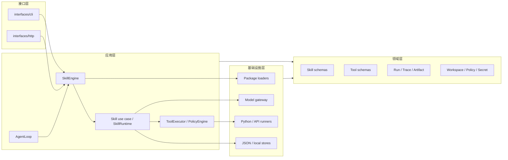
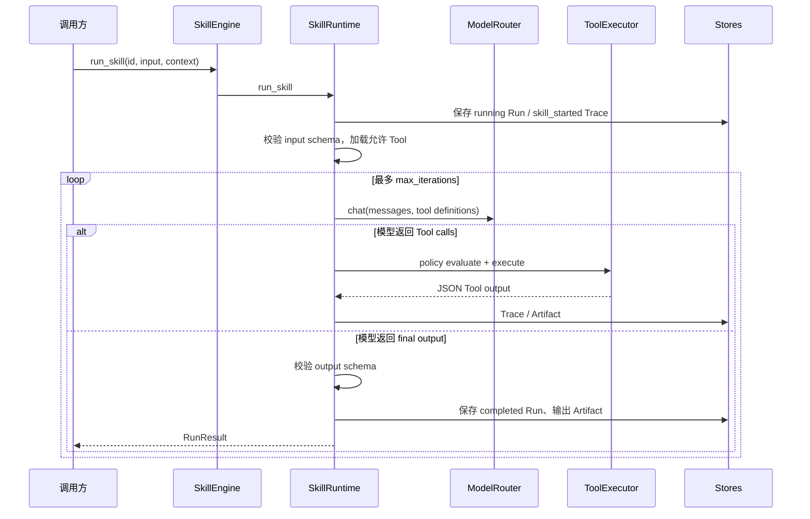
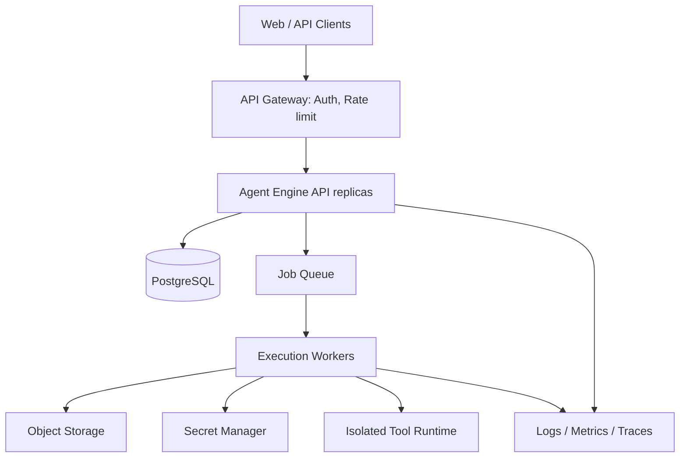

# Agent Engine 架构总览与演进

> **文档状态**：仍有效（0.1.0 内核基线）。1.0.1 平台架构请以 [架构文档_1.0.1](架构文档_1.0.1.md) 为准；本文保留内核分层与演进约束。
>
> 本文以当前代码为准，描述 0.1.0 工程验证版的真实边界，并给出持续迭代时应保持的架构约束。

## 1. 架构目标

Agent Engine 要解决的是“将业务 AI 能力做成可安装、可调用、可观察、可治理的运行单元”。核心原则：

1. **一个运行内核，多种入口**：SDK、CLI、HTTP 与未来桌面端必须复用 `SkillEngine`。
2. **契约先行**：Skill/Tool 的输入和输出均以 JSON Schema 约束，模型输出不能绕过校验。
3. **资源与执行分离**：包加载和注册不等于执行；运行时只处理已注册、被允许的资源。
4. **显式治理**：工作区、身份、Tool policy 与审批是运行上下文的一部分，而不是 UI 逻辑。
5. **可替换基础设施**：应用层只依赖 Ports，当前 JSON/本地实现是适配器，不应渗入业务编排。

## 2. 当前分层



### 2.1 目录与职责

| 目录 | 主要职责 | 不应承担的职责 |
| --- | --- | --- |
| `engine/app/domain/` | Pydantic 领域模型、状态、错误、纯规则对象 | 文件 I/O、HTTP、子进程、框架对象 |
| `engine/app/application/` | 用例、运行时编排、Ports、Policy、Agent 状态机 | provider/数据库具体实现 |
| `engine/app/infrastructure/` | 配置、包加载、模型 provider、Tool runner、持久化适配器 | 把业务流程写死到基础设施中 |
| `engine/app/interfaces/` | Typer/FastAPI、请求转命令、响应/流式输出 | 绕过 Engine 调用 Runtime |
| `engine/resources/` | 可安装的 Skill/Tool/示例输入 | 引擎内部代码 |
| `engine/tests/` | 以行为验证分层边界和运行契约 | 依赖本机真实密钥或外部服务 |

`engine/tests/test_architecture_layers.py` 已对部分层间依赖做约束。新增模块时，优先增加 Port 和适配器，而不是从应用层直接 import 具体 JSON/HTTP 实现。

## 3. 核心对象关系

```text
SkillEngine
 ├─ SkillRegistry / ToolRegistry
 ├─ ModelRouter
 ├─ ToolExecutor
 │   ├─ PolicyEngine
 │   ├─ PythonToolRunner
 │   └─ ApiToolRunner
 ├─ SkillRuntime
 │   ├─ RunStore
 │   ├─ TraceStore
 │   ├─ ArtifactStore
 │   └─ PromptContextAssembler -> MemoryStore
 ├─ WorkspaceStore / SessionStore
 ├─ SecretStore / PolicyStore
 └─ CatalogStore
```

`SkillEngine.load()` 组合生产形态的本地适配器；`create_for_testing()` 使用内存 registry/store 和 Mock provider。任何新入口都应通过其中之一创建 Engine，避免不同入口出现不同的运行语义。

## 4. 关键执行链路

### 4.1 直接运行 Skill



执行限制由 Skill 配置提供：`max_iterations`、`max_tool_calls`、`timeout_seconds`、`max_tokens`、`max_credits` 等。模型可重试错误在运行时按配置处理；Tool 超时由 runner 控制。

### 4.2 Workflow Skill

Workflow 在 `agent.skill.json` 中声明子 Skill 和 `depends_on`。无依赖图时顺序执行；存在依赖时使用 DAG 调度，最多并发 `max_parallel_steps` 个就绪节点。父 Run 聚合子步骤输出、用量、trace 摘要和 artifacts。子 Run 始终独立持久化，便于追查和重跑。

当前实现的语义是：前一步输出会合并进后续上下文。设计新流程时，必须避免不同步骤输出同名字段产生意外覆盖；复杂流程建议使用命名空间对象（如 `brief`、`script`、`storyboard`）而非平铺字段。

### 4.3 Agent 消息

`AgentLoop` 的顺序为：读取 workspace/identity 可见 Skill → 显式 `skill_id` 或 `scene_id` → 元数据关键词评分 → 必填字段解析 → 低置信度确认 → `run_skill` → 保存 session turn。

它不是通用自主 Agent：最大步骤参数目前未用于多动作规划，路由器也不是 LLM。该选择使早期行为更可预测，但不适用于数百个相似 Skill 的智能选择。未来加入模型路由时，应保留显式 Skill 与场景映射的确定性通道。

### 4.4 Tool 审批恢复

`ToolExecutor` 先执行 `PolicyEngine.evaluate_tool_execution()`：

- `allow`：立即执行；
- `deny`：Run 失败；
- `ask`：返回 `TOOL_REQUIRES_CONFIRMATION`，Run 写为 `waiting_approval`。

审批接口更新记录后，调用 `resume_run(run_id)` 会从原始输入重新进入相应 Skill/Workflow。当前设计没有保存“执行到第几个模型回合”的 checkpoint，因此具有副作用的 Tool 必须自行具备幂等性；生产版应补充幂等键和持久化步骤状态。

## 5. 当前持久化拓扑

| 数据 | 当前实现 | 适用范围 | 生产目标 |
| --- | --- | --- | --- |
| Catalog | `.agent/catalog.json` | 单实例资源路径缓存 | 包版本仓库 + 数据库索引 |
| Run/Trace/Session/Workspace/Policy | `.agent/*.json` | 本地、单进程演示 | PostgreSQL，按 workspace 分区/索引 |
| Secret | `.agent/secrets.json` 明文 | 开发调试 | KMS/Vault，审计与轮换 |
| Memory | 本地 Markdown | 个人/原型 | 向量检索 + 结构化元数据 |
| Artifact | 本地 `data/artifacts` | 单机文件产物 | S3/OSS + 生命周期策略 |

JSON store 每次保存写整个文档，未实现跨进程锁、事务、版本冲突处理和高可用。它是开发适配器，不可作为多副本服务的状态源。

## 6. 演进目标架构



迁移时应保持 domain schema、application ports 与 `SkillEngine` 公共行为尽量不变；替换的是基础设施适配器。推荐顺序：先引入数据库 Store 并双写校验，再迁移 Artifact 和 Secret，最后拆分 API 与 worker。

## 7. 架构决策清单

| 决策 | 当前结论 | 后续约束 |
| --- | --- | --- |
| Python Tool | 允许可信本地代码子进程 | 上生产前必须容器/沙箱、资源限制、镜像/签名治理 |
| 模型 profile | Engine 级 active profile，Skill 可指定 profile | 添加模型路由策略、预算与 fallback，但保留可复现的选型记录 |
| 资源安装 | catalog + workspace/identity 绑定 | 增加版本、发布状态、依赖锁定和回滚 |
| 流式输出 | Trace 驱动 SSE/WS | 与真实 token stream、断线续传和长期任务状态对齐 |
| Agent 路由 | 规则优先 | 评测驱动地引入 LLM/router，不把不确定性扩散到权限执行 |

## 8. 变更检查

修改任何运行行为前，检查：

1. domain schema 是否需要兼容性策略；
2. Skill/Tool schema、示例和测试是否同步；
3. CLI、HTTP、SDK 是否仍通过同一用例；
4. Trace、Run、Artifact 是否能解释新行为；
5. 新的外部调用是否经过 policy、secret 和 timeout；
6. 是否需要给生产适配器增加 migration、索引和审计。
