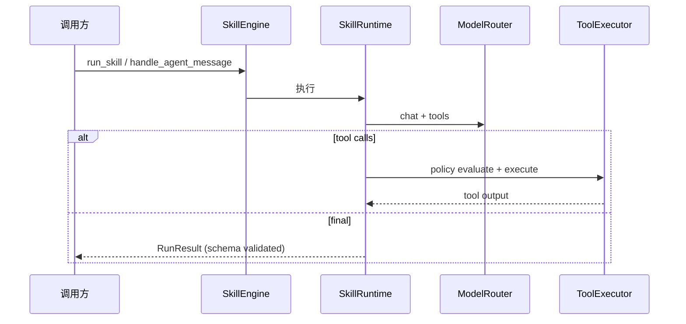
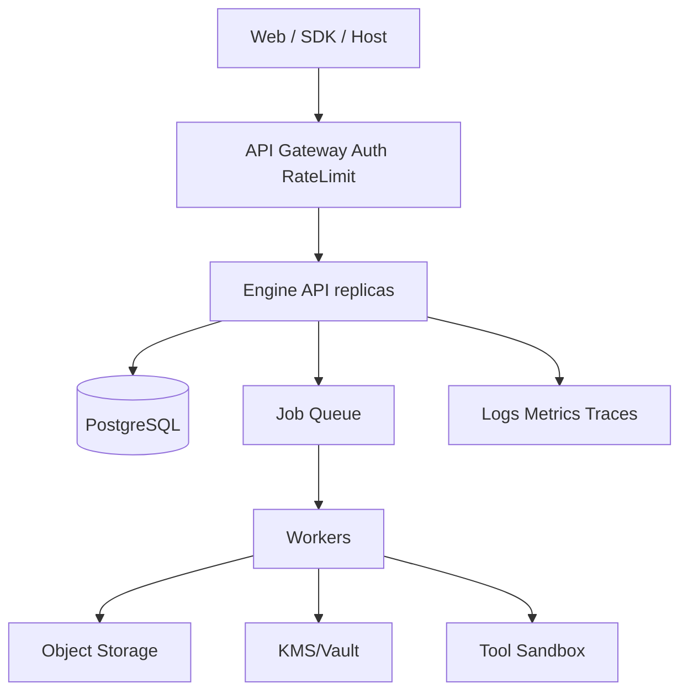

# Agent Engine 架构文档（1.0.1）

状态：本迭代架构基线  
关联：[VERSION_1.0.1](VERSION_1.0.1.md) · [ADR 租户层级](ADR_企业智能体租户与Workspace层级设计.md) · [架构总览与演进](架构总览与演进.md)

## 1. 一句话架构

**一个执行内核（SkillEngine），两层平台模型（平台模板 / 租户实例），两个产品入口（管理控制台 / 用户工作台），所有运行数据以 Tenant 为硬隔离根。**

```text
┌─────────────────────────────────────────────────────────────────┐
│  产品入口                                                         │
│  管理控制台 /console     用户工作台 /app     SDK · CLI · 宿主系统   │
└────────────────────────────┬────────────────────────────────────┘
                             │ 公开 HTTP API + SSE/WS（禁止 import app）
┌────────────────────────────▼────────────────────────────────────┐
│  平台服务层（1.1+ 逐步落地）                                       │
│  Auth · Principal · RBAC · 审计 · 资源注册 · 授权 Grant             │
└────────────────────────────┬────────────────────────────────────┘
                             │
┌────────────────────────────▼────────────────────────────────────┐
│  执行内核 engine/app（0.1.0 已有，保持兼容）                        │
│  SkillEngine → SkillRuntime · AgentLoop · ToolExecutor · Stores  │
└────────────────────────────┬────────────────────────────────────┘
                             │
┌────────────────────────────▼────────────────────────────────────┐
│  基础设施适配器                                                    │
│  当前：JSON/本地文件/Mock·OpenAI·Anthropic                          │
│  目标：PostgreSQL · 对象存储 · KMS · Queue/Worker · 沙箱 Tool       │
└─────────────────────────────────────────────────────────────────┘
```

## 2. 架构原则（1.0.1 锁定）

1. **一个运行内核，多种入口**：SDK / CLI / HTTP / 未来前端共用 `SkillEngine`。
2. **契约先行**：Skill/Tool 输入输出 JSON Schema；管理 API 契约版本化。
3. **配置与执行分离**：IdentityVersion 等 Definition 只描述配置；Session/Run 是运行态。
4. **模板与实例分离**：WorkspaceBlueprint 解决复用；TenantWorkspace 解决隔离。
5. **前端不拥有越权责任**：列表过滤、所有权校验必须在后端仓储层强制。
6. **可替换基础设施**：application 只依赖 Ports；JSON store 是开发适配器。

## 3. 分层与目录

| 层 | 路径 | 职责 | 1.0.1 变化 |
| --- | --- | --- | --- |
| 领域 | `engine/app/domain/` | Schema、状态、纯规则 | 新增 registry/tenant 领域对象（1.1 实现） |
| 应用 | `engine/app/application/` | 用例、编排、Ports | 新增 Identity/Grant use case |
| 基础设施 | `engine/app/infrastructure/` | loader、runner、store | 保留 JSON；为 DB 预留 adapter |
| 接口 | `engine/app/interfaces/` | CLI / FastAPI | 增加管理/用户 API 前缀 |
| 产品原型 | `prototype/` | 设计稿与 HTML 原型 | 新增详设 + web 原型 |
| 工程文档 | `docs/` | 架构/技术/版本 | 索引化 + 1.0.1 基线 |
| 前端工程 | `web/`（预留） | 正式前端 | 1.0.1 仅原型，不建正式工程 |

## 4. 双层领域模型

### 4.1 平台模板层（只读、版本化）

```text
PlatformCatalog
└── WorkspaceBlueprint@version
    ├── SkillVersion references
    ├── IdentityDefinition ── IdentityVersion
    │     ├── model_profile / system_prompt
    │     ├── skill_bindings / tool_bindings
    │     ├── knowledge_bindings / component_bindings
    │     └── routing_policy / conversation_policy
    └── default policies
```

### 4.2 租户实例层（权限与数据硬隔离）

```text
Tenant
└── TenantWorkspace (pinned Blueprint@version)
    ├── TenantCustomizationOverlay（可选，CoW）
    ├── TenantIdentity
    ├── Membership / Role / UserGroup / IdentityGrant
    └── EndUser
        └── AgentSession
            ├── Message / UserMemory
            └── Run → TraceEvent / Artifact / Approval
```

### 4.3 关键约束

| 约束 | 说明 |
| --- | --- |
| Version 不可变 | 发布后的 IdentityVersion / SkillVersion / BlueprintVersion 不可改 |
| 仅 Published 可绑定 | 草稿只能调试，不能服务最终用户 |
| Run 必须有资源快照 | 记录 Agent/Skill/Tool/Prompt/模型 profile 精确版本 |
| Tenant 是顶层作用域 | 所有查询先 `tenant_id`，禁止「先全局 ID 再应用层过滤」 |
| Identity ≠ 最终用户 | Identity 是业务智能体；User 是使用者 |

## 5. 两种执行入口

```text
A. 直接 Skill
   Principal → tenant → tenant_workspace → skill_id@version → user → Run

B. Identity 对话/任务
   Principal → tenant → tenant_workspace → identity → user → session → Run
```

两者最终都落到同一 Run / Trace / Artifact 模型。

## 6. 请求作用域链

```text
Authenticated Principal
  → tenant_id
  → tenant_workspace_id
  → identity_id | skill_id
  → principal_id (user)
  → session_id / run_id
```

强制规则：

1. Session 创建后 owner 字段不可变；
2. Run/Trace/Artifact/Memory 查询必须带所有权条件；
3. SSE/WS 订阅 filter 由服务端按 Principal 生成；
4. 缓存 key 包含 tenant + workspace + principal；
5. Artifact 下载使用短时签名 URL。

## 7. 多用户隔离边界

| 数据 | 默认可见 |
| --- | --- |
| WorkspaceBlueprint / 标准 IdentityVersion | 平台模板只读 |
| TenantWorkspace 配置 | 租户内按角色 |
| Session / Message | 仅 owner 用户 |
| UserMemory | tenant+ws+identity+user |
| Run / Trace / Artifact | 仅 owner；管理读取需提权+审计 |
| Secret | 工作空间/环境受控，永不下发最终用户 |

## 8. 关键执行链路（现状保持）



AgentLoop 顺序：可见 Skill → 显式 skill/scene → 关键词评分 → 输入补齐 → 低置信度确认 → run_skill。  
1.0.1 不改变该语义；1.1+ 将 IdentityVersion 纳入路由与绑定解析。

## 9. 演进目标架构



迁移顺序：先 DB Store 双写校验 → Artifact/Secret → API/Worker 拆分。

## 10. 本迭代架构决策

| 决策 | 结论 | 理由 |
| --- | --- | --- |
| 是否复刻截图 UI | 否，做自有信息架构原型 | 截图仅形态参考，领域不同 |
| 前端位置 | 原型 `prototype/web/`；正式 `web/` 后续立项 | 遵守 openspec 前后端分离提案 |
| Identity 命名 | 产品「智能体」/ 代码 `Identity` | 与 ADR 一致 |
| 隔离优先级 | 高于完整资源中心 | 缺口文档 P0 |
| 本版是否改内核代码 | 默认不改，文档+原型先行 | 避免一次大爆炸变更 |

## 11. 变更检查清单

修改运行行为前确认：

1. domain schema 兼容策略；
2. Skill/Tool schema 与测试同步；
3. CLI/HTTP/SDK 仍走同一用例；
4. Run/Trace 能解释新行为；
5. 外部调用经过 policy/secret/timeout；
6. 新存储是否需要 migration/索引/审计。
