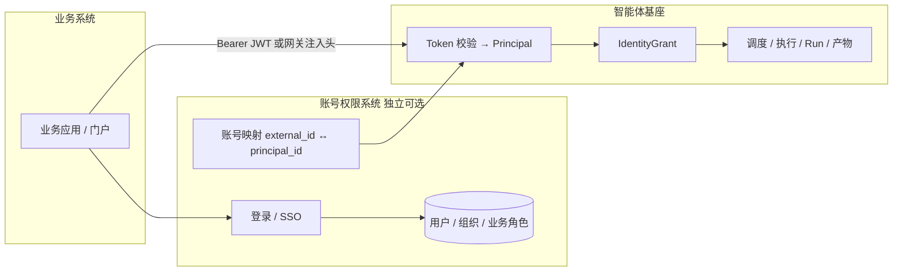

# 账号权限体系边界与业务接入

状态：**架构定论（1.0.1+）**  
关联：[权限架构设计](权限架构设计.md) · [测试账号](测试账号.md) · [架构文档_1.0.1](架构文档_1.0.1.md)

---

## 1. 定论

```text
基座（Agent Engine）只认 Principal，不管账号从哪来。
账号 / 登录 / 组织权威数据 → 独立「账号权限系统」或业务已有 IAM。
```

| 系统 | 管什么 | 不管什么 |
| --- | --- | --- |
| **账号权限系统**（独立可部署） | 登录、密码/SSO、用户主数据、组织、业务侧 RBAC、账号↔基座映射 | Agent 调度、Skill 执行、Run |
| **智能体基座** | Tenant/Workspace/Identity/Skill/Tool/Grant、会话、Run、Trace、产物、审批 | 员工密码、注册找回、通讯录权威源 |

基座在 Session/Run/Artifact 上**只落**：

```text
tenant_id
tenant_workspace_id
principal_id   # 或 owner_principal_id
identity_id / identity_version_id
```

这些值 **怎么来** 由账号体系或网关保证，基座只做校验与隔离。

---

## 2. 总体架构



---

## 3. 三种接入模式（按业务是否已有账号体系）

### 模式 A：业务已有权限体系 → 只做映射

```text
业务 IAM ──签发 JWT──► 基座验签
                claims: sub=业务用户ID
基座侧映射表：identity_links(external_system, external_user_id, principal_id)
```

- 基座**不**重复建员工密码；
- `principal_id` 可直接用业务 `user_id`，或映射到基座稳定 ID；
- 授权仍用基座 `IdentityGrant`（业务角色 ≠ 能否用某个智能体）。

### 模式 B：业务没有账号体系 → 用我们独立的账号权限系统

```text
独立账号系统：注册/登录/组织/角色
     │ 签发 token
     ▼
基座：验签 → Principal → Grant / Run
```

- 账号系统可独立部署，也可作为旁路服务；
- 基座仍不实现找回密码/组织树 UI（管理台可嵌账号系统页面）。

### 模式 C：混合

- 内部员工走企业 SSO（模式 A）；
- 外部渠道/C 端走账号系统开户（模式 B）；
- 同一租户下并存，统一映射到 `principal_id`。

---

## 4. 基座侧唯一契约：Principal

```text
Principal
  tenant_id
  principal_id          # 稳定用户 ID（来源：业务或账号系统）
  principal_type        # user | service_account | platform_operator
  workspace_roles[]     # 基座管理角色（可来自账号系统 claim，也可本地维护）
  group_ids[]           # 用于 IdentityGrant 批量授权
  display_name?
```

**优先级（生产）：**

1. 校验业务/账号系统 JWT（issuer、jwks、audience、exp）
2. 可信网关注入头（仅内网）
3. 本地运维登录（平台/租户管理员，可选）

1.0.1 已有：登录 API + 哈希密码 + Bearer dev token + 头桩（联调）。  
生产把 (1) 接到 JWT，本地 `auth_users` 收缩为运维账号。

---

## 5. Web 端该做什么、不该做什么

| 模块 | 归属 | 说明 |
| --- | --- | --- |
| 员工登录/注册/找回/MFA | 账号系统或业务门户 | **不要**做在基座管理台 |
| 通讯录、部门、职级 | 业务/账号系统 | 基座最多缓存 display_name |
| 业务菜单权限 | 业务系统 | 与「能否用智能体」无关 |
| 智能体是否可用 | 基座 `IdentityGrant` | 唯一授权源 |
| 会话/Run/产物 | 基座 | 按 `principal_id` 隔离 |
| `/console` 管理台 | 基座 | 运维/开发者；登录可接 SSO |
| `/app` 工作台 | 基座 API | **登录态由业务门户注入**，可 iframe/SDK |

---

## 6. 账号映射表（建议）

独立账号系统或基座侧均可持有，推荐账号系统持有、基座只读缓存：

```text
identity_links
  external_system     -- oidc | hr | crm | self
  external_user_id
  tenant_id
  principal_id        -- 基座稳定 ID
  status
  updated_at
```

规则：

- `principal_id` 一旦绑定尽量不变（Run/产物所有权依赖它）；
- 离职/禁用在账号系统侧处理，基座可缓存 `is_active` 或实时查；
- 禁止用可变手机号/邮箱直接当主键。

---

## 7. 1.0.1 现状 vs 目标

| 项 | 现状 | 目标 |
| --- | --- | --- |
| 本地 `auth_users` | 含演示员工 | 仅运维账号或下线 |
| 登录 | 账号密码 + dev token | JWT 验签 |
| 头桩 | 有 | 仅可信网关 |
| 账号映射 | 未建 | `identity_links` |
| 独立账号系统 | 未拆仓 | 可独立部署（模式 B） |
| 基座 | 已落 tenant/principal 到 Run | 不变，继续只认 Principal |

实现位置（联调用，非终态）：

- `engine/app/application/platform/passwords.py`（哈希）
- `engine/app/infrastructure/persistence/auth_store_pg.py`
- `engine/scripts/seed_auth_users.py` / `init_auth_schema.sql`

---

## 8. 建议演进

1. **定契约**：JWT claims → Principal 映射表（本文 §4/§6）  
2. **基座**：`PrincipalProvider` 抽象，JWT 优先  
3. **账号系统**：独立服务（或直接接客户 IAM）  
4. **收缩本地账号**：删员工 seed，只留 `platform.admin` 等  
5. **工作台**：业务门户带 token 打开，不走基座登录页  

---

## 9. 一句话

> **业务/账号系统回答「你是谁」；基座回答「这个智能体你能用吗、数据归谁」；中间只靠 Principal + Grant。**
